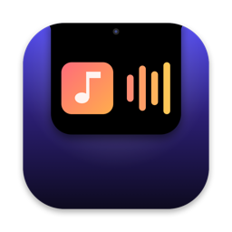
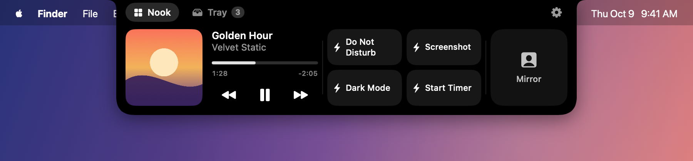
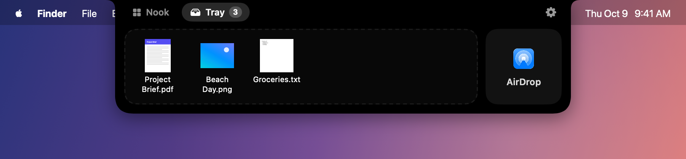
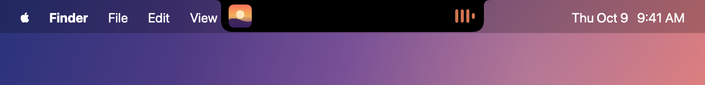
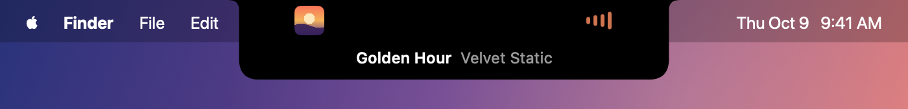

<p align="center">
  
</p>

<h1 align="center">Cranny</h1>

<p align="center">
  A free, open-source home for everything in your MacBook's notch.<br>
  Media controls, a files tray with AirDrop, your calendar, a camera mirror, Shortcuts and live activities.
</p>

<p align="center">
  <a href="https://github.com/Anjel-Patel/Cranny/actions/workflows/build.yml"></a>
</p>

<p align="center">
  <a href="https://github.com/Anjel-Patel/Cranny/releases/latest"><b>Download</b></a> ·
  <a href="#install">Install</a> ·
  <a href="#build-from-source">Build from source</a>
</p>



If you used NotchNook, Cranny will feel familiar: a "nook" of widgets, a files tray
with AirDrop, and live activities around the notch. It even picks up your NotchNook
settings on first launch. Cranny is an independent project and isn't affiliated with
lo.cafe or NotchNook.

## Features

### The notch

- Hover to wake the notch, then click (or swipe down on the trackpad) to open it, or
  have it open on hover.
- Haptic feedback, an optional translucent background, notch width fine-tuning, and a
  demo mode for screen recordings.
- Macs without a notch get a small handle at the top of the main screen that works
  the same way. External displays can show one too, and notch sizes and display
  scaling are picked up automatically.

### Nook widgets

Arrange widgets on a grid (one cell is 50pt), then reorder and resize them. Widgets
that don't fit are hidden.

- **Media player**: works with anything that shows up in Control Center's Now Playing,
  such as Spotify, Apple Music, YouTube in your browser, IINA and VLC. You get artwork,
  a scrubbable progress bar and playback controls. Click the artwork to jump to the
  app that's playing.
- **Calendar**: the day's events, with one-click Join buttons for Zoom, Meet, Teams and
  more. Swipe left or right to change days.
- **Mirror**: a quick look at your front camera before a call. The camera only runs
  while the mirror is on.
- **Shortcuts**: run your macOS Shortcuts from the notch.

### Files tray



- Drag files onto the notch and drop them in the tray to keep them handy while you
  switch apps or spaces. Drag them back out to move them where you need them.
- Drop files on **AirDrop** to share them.
- Images, links and text dropped on the tray are saved as files.

### Live activities

| While music plays | Quick Peek on hover |
| --- | --- |
|  |  |

- Album art plus an audio visualizer tinted with the album's colours, a countdown to
  your next meeting, or the number of files in the tray.
- Hover for a Quick Peek. Click to play/pause or join a meeting.
- Two-finger swipes over the notch: down or up to open or close it, left or right to
  change tracks.

## Install

1. Download `Cranny.zip` from the [latest release](https://github.com/Anjel-Patel/Cranny/releases/latest),
   unzip it and move **Cranny** to your Applications folder.
2. Cranny isn't notarized by Apple yet (that requires a paid developer account), so
   macOS blocks the first launch. Either run this once in Terminal:

   ```sh
   xattr -dr com.apple.quarantine /Applications/Cranny.app
   ```

   or open Cranny, then go to **System Settings → Privacy & Security** and click
   **Open Anyway**.
3. Open Cranny and hover over your notch. Settings are behind the gear in the open
   notch, or right-click the notch.

Requires macOS 14 Sonoma or later, on Apple silicon or Intel.

## Permissions and privacy

- **Calendar** (optional): only needed for the Calendar widget and calendar live activity.
- **Camera** (optional): only used while the Mirror is switched on.

Cranny doesn't need Accessibility or Screen Recording access, and it makes no network
requests.

## Build from source

You need the Xcode Command Line Tools (`xcode-select --install`). Full Xcode isn't
required.

```sh
git clone https://github.com/Anjel-Patel/Cranny.git
cd Cranny
./build.sh --install   # builds, installs to /Applications and launches it
```

`./build.sh` on its own leaves the app in `build/Cranny.app` and a zip next to it.
Add `--universal` to build for both Apple silicon and Intel. Local builds are signed ad
hoc, so macOS may ask for Calendar or Camera access again after you rebuild.

### Trying other notch sizes

You can make Cranny pretend your main screen has a different notch, or none at all,
to check layouts for other Macs. Relaunch Cranny after changing it:

```sh
defaults write io.github.rdbms234.Cranny debugNotchSize 200x38   # width x height in points
defaults write io.github.rdbms234.Cranny debugNotchSize none     # a Mac without a notch
defaults delete io.github.rdbms234.Cranny debugNotchSize         # back to normal
```

## How Now Playing works

Since macOS 15.4, only Apple-signed processes can read the system's Now Playing
information. Cranny therefore runs a small helper library (`Helper/MediaHelper.m`)
inside the system's own `/usr/bin/perl`. The helper streams playback state back to
the app, passes on play/pause/skip/seek commands, and quits along with Cranny. Thanks
to [mediaremote-adapter](https://github.com/ungive/mediaremote-adapter) for
popularising this approach.

## Automation

```sh
open -g "cranny://open"              # open the nook (it stays open until you hover it)
open -g "cranny://open?tab=tray"
open -g "cranny://toggle"
open -g "cranny://close"
open "cranny://settings?pane=nook"   # general, nook, live, calendar, shortcuts, about
```

## Uninstall

Turn off **Launch at login** in Cranny's settings, quit it (right-click the notch →
Quit Cranny), then delete `/Applications/Cranny.app` and
`~/Library/Application Support/Cranny`.

## Feedback

Cranny is a young project. If something doesn't work on your Mac, please
[open an issue](https://github.com/Anjel-Patel/Cranny/issues). Pull requests are welcome.

## Credits

Made with the help of Claude.

## License

[MIT](LICENSE)
